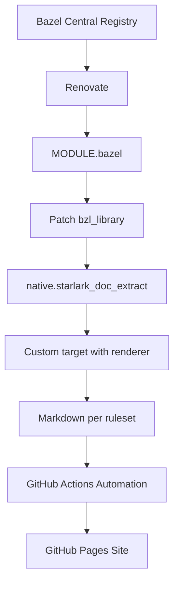

# EXPERIMENTAL Starlark docgen pipeline

This project automates the generation and publication of documentation for Bazel rules.
Using the Bazel Central Registry as a source, Renovate automatically updates the MODULE.bazel file to keep dependencies current.

We patch the `bzl_library` targets to include `native.starlark_doc_extract` rules, enabling the extraction of documentation directly from Starlark sources.
A custom build target then uses our renderer (a small TypeScript program in this repo) to convert the protobufs into structured Markdown files, one per ruleset.
Finally, a GitHub Actions workflow publishes these Markdown files to a GitHub Pages site, making the documentation easily accessible and always up to date.

## Future work

We might want the GHA automation to add commits of `.binaryproto` files to this project.

That way older versions of a module have docgen available too, not just the latest.

This could be used as a datasource for https://github.com/bazel-contrib/bcr-ui to add API docs for the rulesets it displays, just like it gets BCR data.

## Data flow

